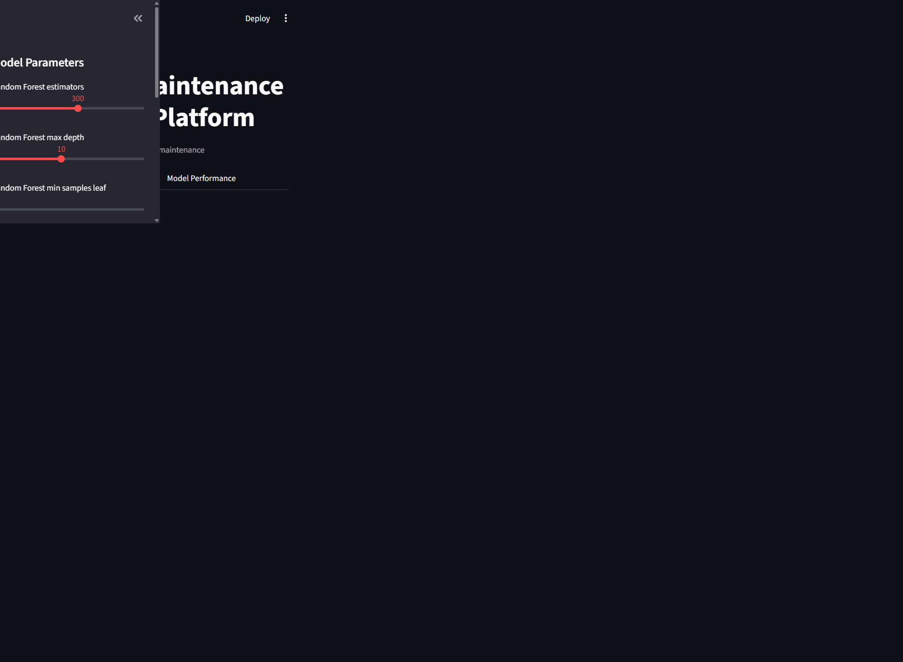
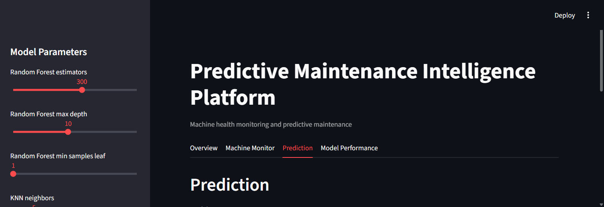

# Predictive Maintenance Intelligence Platform

A small Streamlit dashboard for exploring machine health records, predicting
machine status from sensor readings, and tuning the hyperparameters of four
classification models.





## Features

- Machine health overview and status distribution
- Machine-by-machine sensor readings
- Prediction from Temperature, Vibration, Pressure, RPM, Current, and
  OperatingHours
- Random Forest, K-Nearest Neighbors, Logistic Regression, and Decision Tree
  classifiers
- Sidebar controls for selected model hyperparameters and a button to retrain
  and save the models
- Evaluation report with accuracy, precision, recall, F1, and confusion matrix

## Requirements

- Python 3.10 or newer
- Dependencies listed in [requirements.txt](requirements.txt)

## Setup and run

From the project directory, create and activate a virtual environment, then
install the dependencies:

```powershell
py -m venv .venv
.\.venv\Scripts\Activate.ps1
python -m pip install --upgrade pip
python -m pip install -r requirements.txt
```

Train the models and produce the processed dataset and evaluation report:

```powershell
python train.py
```

Start the dashboard:

```powershell
streamlit run app.py
```

Streamlit prints the local dashboard URL in the terminal. Use the sidebar
sliders and **Retrain Models** to update the saved models. The Prediction tab
lets you choose one of the saved models and enter sensor readings.

## Data

The sample data is in `data/maintenance_data.csv`. It contains a
`Machine_ID`, six sensor/usage measurements, and a `Status` label. The project
preprocesses the file and writes generated data under `data/processed/`.

The dataset file does not include source or licensing metadata. Its upstream
provenance has not been independently established; verify the right to
redistribute it before publishing this repository.

## Models and evaluation

The training script uses a stratified train/test split and a fixed random seed.
KNN and Logistic Regression are scaled in scikit-learn pipelines. The
evaluation report is generated from the held-out split and written to
`outputs/evaluation_report.json`.

The included sample is very small, so its evaluation scores are illustrative
only and should not be treated as evidence of production performance.

## Citations

- Pedregosa, F. et al. (2011). *Scikit-learn: Machine Learning in Python*.
  Journal of Machine Learning Research, 12, 2825–2830.
  https://jmlr.org/papers/v12/pedregosa11a.html
- McKinney, W. (2010). *Data Structures for Statistical Computing in Python*.
  Proceedings of the 9th Python in Science Conference, 56–61.
  https://doi.org/10.25080/Majora-92bf1922-00a
- Streamlit documentation: https://docs.streamlit.io/

## License

The project code is licensed under the MIT License; see [LICENSE](LICENSE).
This statement does not establish the licensing or redistribution rights of
the sample dataset or third-party dependencies.
